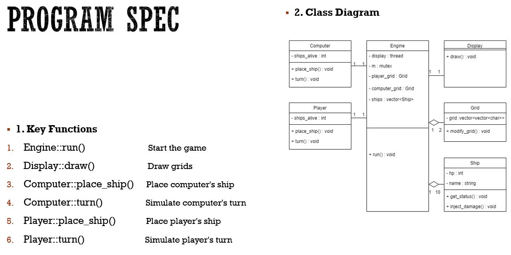
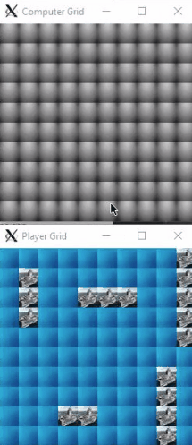

# Battleship C++

Battleship is a fun game where your goal is to sink the enemy(computer)'s ships.



### Build Instructions
Git clone:
```bash
~$ git clone https://github.com/chanchoi829/battleship_cplusplus.git
~$ cd battleship_cplusplus
```

Make and Run:
```bash
~/battleship_cplusplus $ sudo apt-get install libpng-dev libjpeg-dev libtiff-dev
~/battleship_cplusplus $ mkdir build && cd build 
~/battleship_cplusplus/build $ cmake ../
~/battleship_cplusplus/build $ make -j24
~/battleship_cplusplus/build $ ./battleship
 
```

Make sure you have a display server running.

### How to Play



