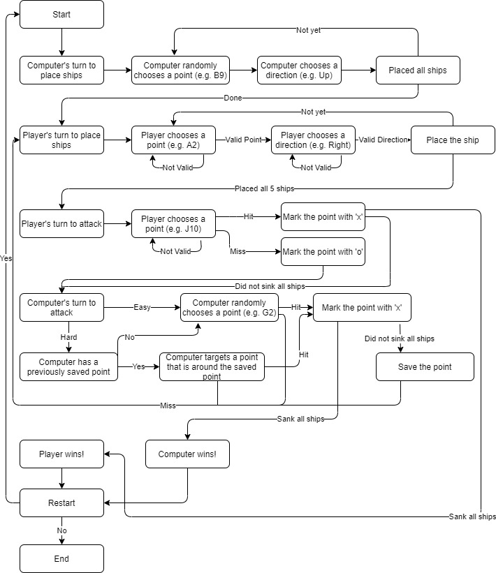

# Battleship C++

### Build Instructions
Git clone:
```bash
$ git clone https://github.com/chanchoi829/battleship_cplusplus.git
$ cd battheship_cplusplus
```

Make and Run:
```bash
$ make
$ ./battleship
```


