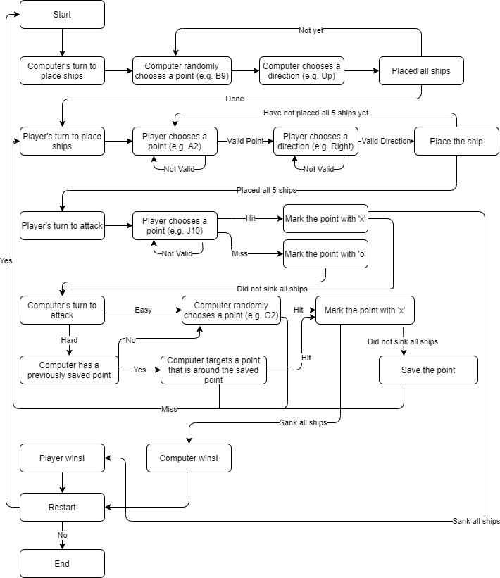

# Battleship C++

Battleship is a fun game where your goal is to sink the enemy(computer)'s ships.

### Flow Diagram



### Build Instructions
Git clone:
```bash
$ git clone https://github.com/chanchoi829/battleship_cplusplus.git
$ cd battheship_cplusplus
```

Make and Run:
```bash
$ make
$ ./battleship
```

### How to Play

**Choose Difficulty**
```
Example: hard
Choose difficulty easy/hard: hard
```

**Place Your Ships**
Note: ships cannot overlap and must be placed on the grid!

```
Example: G5
Place your Destroyer(length 2): a3
```


```
Example: right
Enter the direction(left/right/up/down): down
```

```
      Your Grid
  1 2 3 4 5 6 7 8 9 10
A . . d . . . . . . .
B . . d . . . . . . .
C . . . . . . . . . .
D . . . . . . . . . .
E . . . . . . . . . .
F . . . . . . . . . .
G . . . . . . . . . .
H . . . . . . . . . .
I . . . . . . . . . .
J . . . . . . . . . .
```

d = Destroyer (length 2)
s = Submarine (length 3)
c = Cruiser (length 3)
b = Battleship (length 4)
C = Carrier (length 5)

**Example: After You Place All 5 Ships**
```
      Your Grid
  1 2 3 4 5 6 7 8 9 10
A . . d . . . . . . .
B . . d . . . . . . .
C . . . . . . . C . .
D . s s s . . . C . .
E . . . . . . . C . .
F . b b b b . . C . .
G . . . . . . . C . .
H . . . . . . . . . c
I . . . . . . . . . c
J . . . . . . . . . c
```

**Attack a Point**
If you hit the computer's ship, the point is marked with an x.
If you miss, the point is marked with an o.

After you attack, the computer attacks.
After the computer attacks, you attack.
Game keeps going until someone's ships are all sunk.
```
Example: G5
Attack a point: c3
Hit!
Computer attacks B9. Missed!

      Enemy Grid
  1 2 3 4 5 6 7 8 9 10
A . . . . . . . . . .
B . . . . . . . . . .
C . . x . . . . . . .
D . . . . . . . . . .
E . . . . . . . . . .
F . . . . . . . . . .
G . . . . . . . . . .
H . . . . . . . . . .
I . . . . . . . . . .
J . . . . . . . . . .

      Your Grid
  1 2 3 4 5 6 7 8 9 10
A . . d . . . . . . .
B . . d . . . . . . .
C . . . . . . . C . .
D . s s s . . . C . .
E . . . . . . . C . .
F . b b b b . . C . .
G . . . . . . . C . .
H . . . . . . . . . c
I . . . . . . . . . c
J . . . . . . . . . c
```
**Example: You Sank Computer's Ships First**
```
      Enemy Grid
  1 2 3 4 5 6 7 8 9 10
A x o o o o o o o . o
B x x . . . . . . o .
C x x x x x . . x . .
D . x . . . . . . . o
E o x o o o . . . . x
F . x . . . . . . . x
G . . . . . . . . . x
H o o o o o o o o o x
I . . . . . . . . . o
J o o o o o o o o o o


      Your Grid
  1 2 3 4 5 6 7 8 9 10
A . . x . . . . . . .
B . . x . . . . . . .
C . . . . . . . x . .
D . x x x . . . x . .
E . . . . . . . x . .
F . x x x b . . x . .
G . . . . . . . x . .
H . . . . . . . . . x
I . . . . . . . . . x
J . . . . . . . . . x

***************************
Computer's Destroyer(length 2): afloat
Computer's Submarine(length 3): sunk
Computer's Cruiser(length 3): sunk
Computer's Battleship(length 4): sunk
Computer's Carrier(length 5): sunk

Example: G5
Attack a point: c9
Hit!
Computer's Destroyer sunk!
You Win!
```

**Restart**
When the game ends, you can restart by typing yes.
If you do not want to, type no.
```
Restart?
Type yes or no
no
```